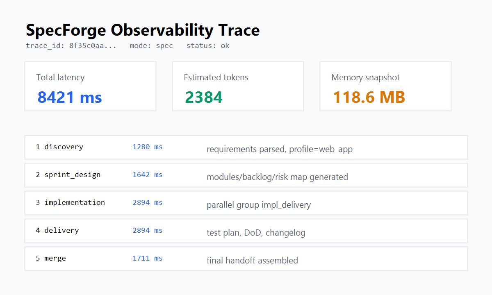

🔗 Live Demo: https://spec-forge-phi.vercel.app/

🔎 Backend Health: https://ishowrelx5-specforge-api.hf.space/api/v1/health

# SpecForge — AI 软件工程规格锻造

[](https://www.python.org/)
[](https://fastapi.tiangolo.com/)
[](https://docs.pydantic.dev/)
[](https://nextjs.org/)
[](https://www.langchain.com/)
[](https://platform.moonshot.cn/)
[](https://redis.io/)
[](https://www.typescriptlang.org/)
[](https://tailwindcss.com/)
[](https://github.com/TraitYoung/specForge/actions/workflows/ci.yml)

**公开仓库：** [github.com/TraitYoung/specForge](https://github.com/TraitYoung/specForge) · **实现映射：** [docs/ARCHITECTURE.md](docs/ARCHITECTURE.md)

**Vibe coding 的 demo → 可维护的生产级项目。**

让 AI 写代码很快，但代码写完之后的麻烦事更多——没需求文档、没测试、架构说不清，中断几天回来就不记得做到哪了。SpecForge 在代码生成的同时补上工程规格：需求拆解、Sprint 规划、实现草案、测试方案，让项目能持续迭代而不是烂在初期。

## 工程亮点

- **结构化输出**：Pydantic v2 强类型契约 + field_validator 字段级约束，每步可验证，不会产生协议漂移
- **Token 成本内建**：步骤间只传 JSON 摘要，上下文预算统一管理，用户原文与摘要均有硬截断上限
- **全链路追踪**：每轮返回 trace_id + trace[]，记录每步骤耗时与关键输出，支持性能复盘
- **项目画像自动匹配**：关键词检测识别 Web/Mobile/API/Data/Game Tools 共 5 种项目类型，注入对应工程关注点与输出偏好
- **步骤级模型路由**：发现/设计/实现/交付/合并各步骤可独立配置不同 LLM 模型，按步骤粒度调配成本与能力
- **阶段 2 并行执行**：实现草案与测试交付通过 ThreadPoolExecutor 并行运行，降低端到端延迟
- **RAG 检索增强**：正向自动检索历史相似规格作为参考上下文，逆向积累高频代码问题模式，越用越准
- **SSE 流式输出**：聊天气泡仅展示短摘要；完整 **SPEC.md / REVIEW.md** 实现包落盘至 `output/chats/`，支持一键复制 Cursor Prompt 或下载

## 两种工作模式

### 正向工程 (Spec)：想法 → 工程规格

输入你的需求描述，系统输出一份结构化的软件工程交付包：

1. **需求发现** — 用户故事、验收标准、Sprint 目标、可度量结果
2. **Sprint 设计** — 模块拆分、数据流、有序待办、技术探针、停车场
3. **实现草案** — MVP 核心路径代码草稿（含语言标识与依赖说明）
4. **测试与交付** — 测试用例、完成定义 (DoD)、CI/CD 提示、CHANGELOG、Sprint 回顾

聊天气泡为**摘要**；完整包含 **Implementation / Test Prompt**、代码草稿与 Release Notes，保存为 `output/chats/*_SPEC.md`，可在界面复制或下载后拖入 Cursor/Copilot。

### 逆向审查 (Review)：代码 → 审查报告

粘贴你通过 vibe coding 产出的代码，系统反向推导：

- 推测的业务目标与用户故事
- 缺失的测试用例
- 架构问题（耦合、职责不清、缺少抽象）
- 代码质量问题（命名、错误处理、硬编码）
- 按优先级排列的改进计划

附带**可直接粘贴到 Cursor 的重构 prompt**。

## 快速开始

### 一键启动（推荐）

双击项目根目录的 **`start_dev.bat`**，自动启动 Redis + Backend + Frontend，端口就绪后打开浏览器。

### 手动启动

**1. 环境配置**

```bash
pip install -r requirements.txt
cp .env.example .env
```

`.env` 中至少配置（默认 **Moonshot Kimi 2.6**）：
```bash
LLM_API_KEY=你的_Moonshot_API_Key
LLM_BASE_URL=https://api.moonshot.cn/v1
LLM_MODEL=kimi-k2.6
```
Key 在 [platform.moonshot.cn](https://platform.moonshot.cn/) 创建；海外 `LLM_BASE_URL` 用 `https://api.moonshot.ai/v1`。旧版 `QWEN_*` 仍兼容。

**2. 启动服务**

```powershell
# 终端 1 — Redis（可选，会话缓存）
redis-server --port 6379

# 终端 2 — 后端 FastAPI
python -m uvicorn main:app --app-dir backend --host 127.0.0.1 --port 8000 --reload

# 终端 3 — 前端 Next.js
cd frontend && npm install && npm run dev
```

浏览器打开 `http://localhost:3000`。

## 项目结构

```
├── backend/
│   ├── main.py                          # FastAPI 入口
│   ├── agents/dev_pipeline/
│   │   ├── orchestrator.py              # 核心编排：正向 5 步 + 逆向审查
│   │   └── step_agents.py               # 各步骤 Agent 配置与执行
│   ├── config/
│   │   ├── context_budget.py            # Token 预算控制
│   │   └── step_model_routing.py        # 步骤级模型路由
│   ├── schemas/
│   │   ├── workflows.py                 # 5 个流水线 Pydantic 模型 + Prompt 生成
│   │   ├── protocols.py                 # TaskIntent
│   │   └── trace.py                     # TraceStep
│   ├── memory/
│   │   ├── session_cache.py             # Redis 会话缓存
│   │   ├── project_cache.py             # 项目记忆
│   │   └── spec_store.py                # SQLite FTS5 规格检索
│   └── prompts/
│       └── dev_pipeline_profiles.py     # 5 种项目画像检测
├── frontend/                            # Next.js 16 + Tailwind v4
│   ├── app/
│   │   ├── page.tsx                     # 聊天主页面（SSE + Trace 面板）
│   │   └── api/                         # API 反向代理到 FastAPI
│   └── lib/backend.ts
├── tests/                               # pytest（32 用例）
├── scripts/
│   ├── dev_stack.ps1                    # 开发环境管理
│   └── locustfile.py                    # 压测入口
├── start_dev.bat                        # 一键启动
├── docker-compose.yml
└── requirements.txt
```

## API

| 端点 | 方法 | 说明 |
|------|------|------|
| `/api/v1/health` | GET | 健康探活 |
| `/api/v1/chat` | POST | 非流式对话 |
| `/api/v1/chat/stream` | POST | SSE 流式输出（推荐） |
| `/api/v1/chat/history` | GET | 会话历史（需 `x-session-id`） |
| `/api/v1/chat/export` | POST | 导出会话为 JSONL |

```json
{
  "text": "做一个个人记账 App，支持多账户、分类预算、月度报表...",
  "mode": "spec"
}
```

`mode` 取值：`"spec"`（正向工程，默认）或 `"review"`（逆向审查）。

## 开发约定

- 遵循 [CONTRIBUTING.md](CONTRIBUTING.md) 中的工程规范
- 后端：`python -m compileall backend -q && pytest`
- 前端：`cd frontend && npx tsc --noEmit && npm run build`
- 架构细节见 [docs/项目结构与技术要点.md](docs/项目结构与技术要点.md)
## 部署指南

### 推荐拓扑

- Frontend: Vercel, root directory 选择 `frontend`, 构建命令 `npm run build`, 安装命令 `npm ci`.
- Backend: Hugging Face Spaces Docker, 当前后端地址为 `https://ishowrelx5-specforge-api.hf.space`.
- Redis: Upstash Redis 免费层, 将 TLS Redis 连接串填入 Hugging Face Space Secrets 的 `REDIS_URL`. Redis 不可用时系统会降级为无会话缓存, 核心生成能力仍可用.
- Database: SQLite FTS5, 首次启动由 `SpecStore._migrate()` 自动初始化 `data/spec_store.db`. Hugging Face 免费 Space 的磁盘不保证长期持久化, 作品集 demo 可接受; 生产环境应迁移到托管数据库.

### 环境变量

Backend(Hugging Face Space Secrets):

```bash
LLM_API_KEY=your_moonshot_api_key
LLM_BASE_URL=https://api.moonshot.cn/v1
LLM_MODEL=kimi-k2.6
LLM_STRUCTURED_MODE=json_prompt
LLM_REQUEST_TIMEOUT=300
REDIS_URL=rediss://default:<password>@<host>:6379
```

Kimi K2.6 默认开启思考模式，端到端生成可能需数分钟；可选 `LLM_THINKING=disabled` 提速。

Frontend(Vercel):

```bash
BACKEND_URL=https://ishowrelx5-specforge-api.hf.space
```

### Docker Compose

本地或单机部署可以直接使用:

```bash
cp .env.example .env
docker compose up --build -d
curl http://127.0.0.1:8000/api/v1/health
```

日志查看:

```bash
docker compose logs -f api
docker compose logs -f frontend
```

### Hugging Face Spaces 后端

1. 后端使用独立的 Hugging Face Space 仓库 `iShowRelx5/specForge-api`, 由本地 `hf-space/` 目录推送。
2. Space SDK 选择 Docker, 监听端口 `7860`; `hf-space/README.md` 顶部保留 `sdk: docker` / `app_port: 7860` metadata.
3. 在 Space **Settings → Repository secrets** 中设置：
   | Secret | 值 |
   |--------|-----|
   | `LLM_API_KEY` | Moonshot 控制台 API Key |
   | `LLM_BASE_URL` | `https://api.moonshot.cn/v1`（海外：`https://api.moonshot.ai/v1`） |
   | `LLM_MODEL` | `kimi-k2.6` |
   | `REDIS_URL` | Upstash 等 Redis 连接串（可选） |
   旧 Secret 名 `QWEN_*` 仍可用，建议改名为 `LLM_*`。
4. 保存后 **Restart Space**。访问 health 应看到 `env.has_llm_key: true`、`env.llm_model: "kimi-k2.6"`。

常用推送命令:

```powershell
.\scripts\sync_hf_space.ps1
cd hf-space
git add -A
git commit -m "deploy backend update"
git push origin main
```

### Vercel 前端

1. Import Git Repository, root directory 填 `frontend`.
2. Environment Variables 填 `BACKEND_URL=https://ishowrelx5-specforge-api.hf.space`.
3. 部署后访问 `/api/health`, 确认能代理到后端.
4. 部署成功后, 将本 README 第一行 Live Demo 替换为真实 Vercel URL; 在此之前不要填写会 404 的占位域名.

前端推送到 GitHub `main` 后 Vercel 会自动部署; 如未触发, 在 Vercel -> Deployments 手动 Redeploy。

## 监控与日志

`GET /api/v1/health` 返回服务版本、启动时长、Redis/SQLite 状态、进程内存和关键环境变量是否存在。请求日志会记录 `trace_id`, path, status, duration_ms 和 client_ip; 流水线日志会记录每一步耗时、估算 token 和内存快照。



## 容错设计

完整说明见 [docs/RELIABILITY.md](docs/RELIABILITY.md). 当前版本覆盖 Pydantic 结构化校验、API 限流、Redis 降级、SQLite 写入失败保护、上下文预算裁剪、SSE 错误事件和生产健康检查。
